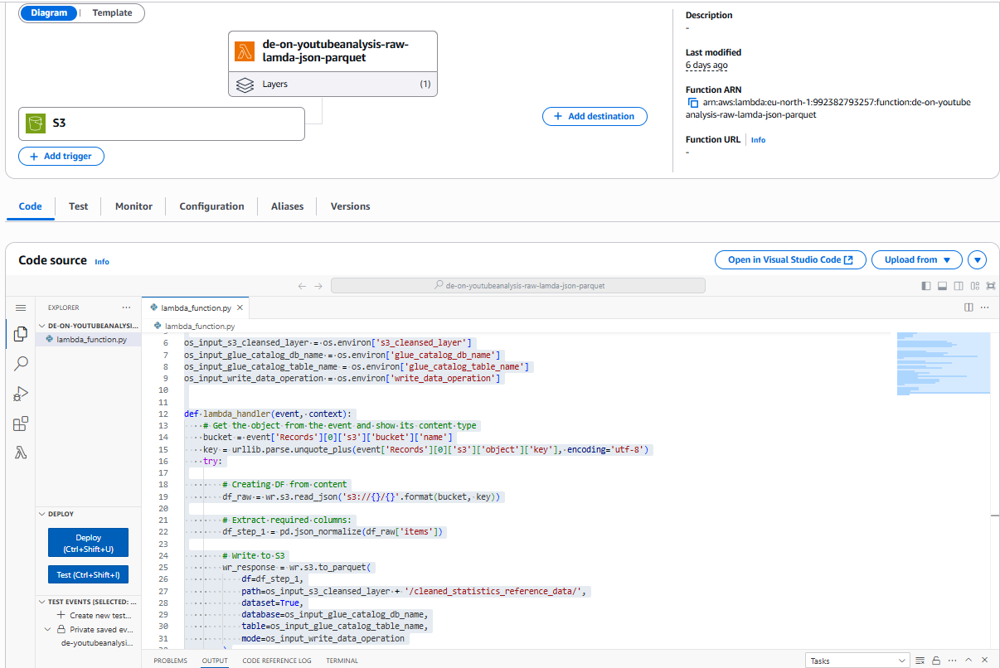
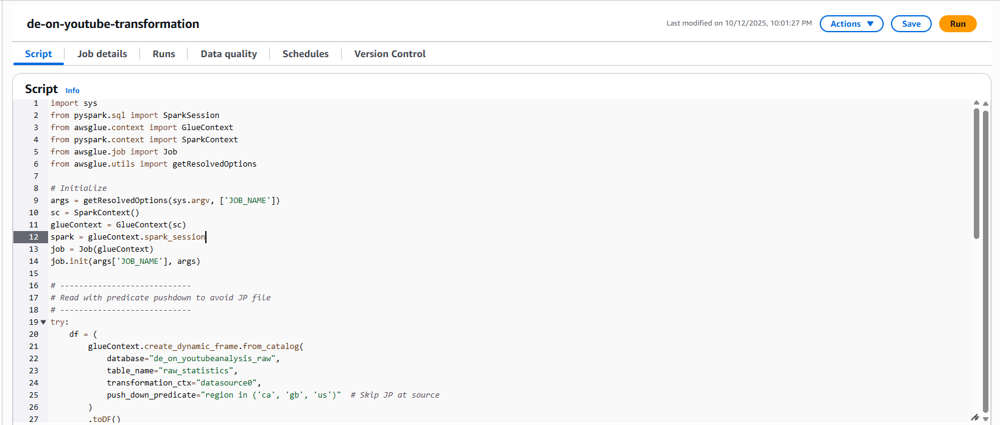
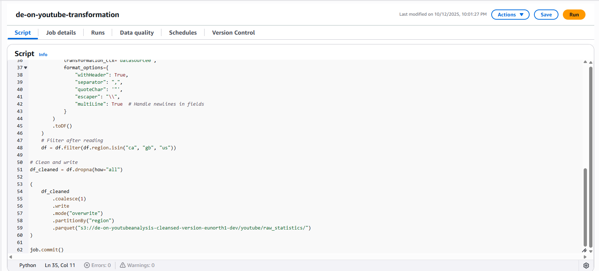
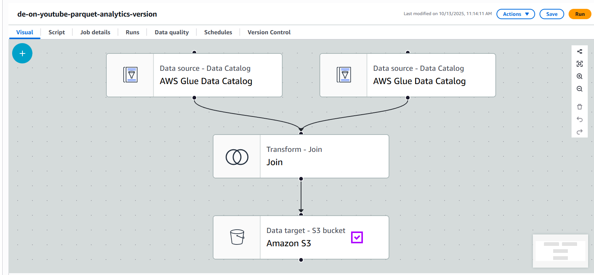
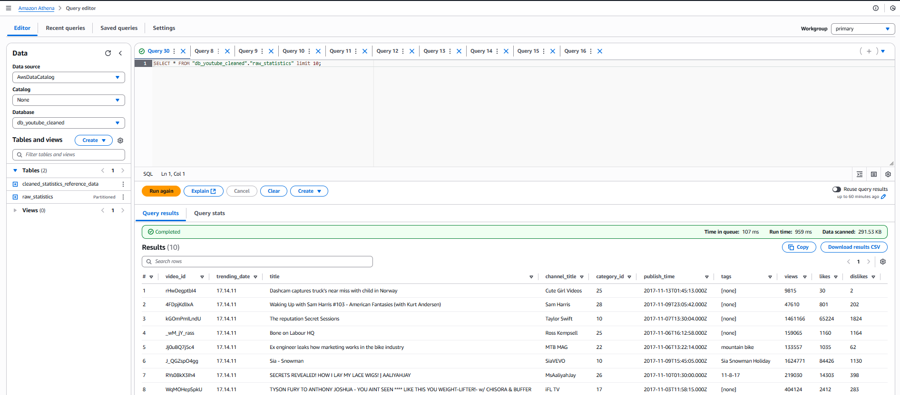
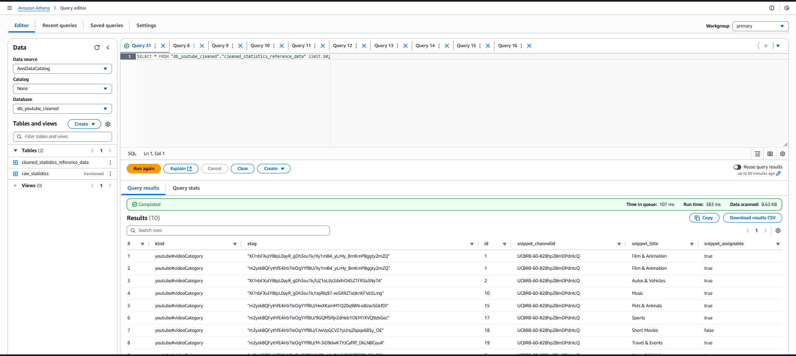
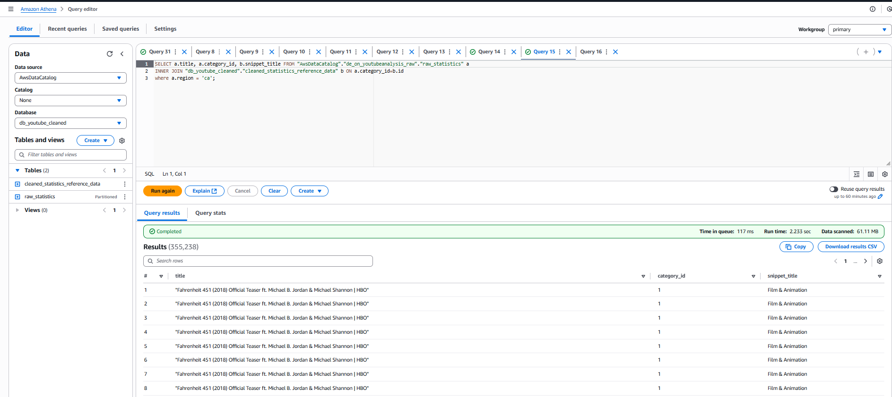
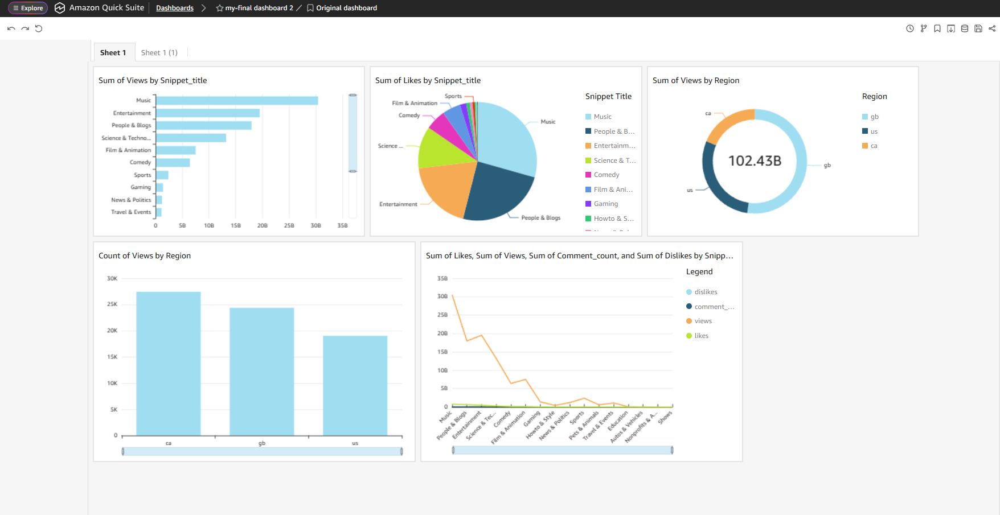

# Cloud Data Lake Architecture

**A production-ready AWS data architecture for enterprise analytics**

## Overview
- **Architecture Type:** Modern data lake with medallion pattern (Bronze/Silver/Gold)
- **Tech Stack:** AWS S3, AWS Glue, Lambda, Athena, Redshift, Qlik, AWS Cloudwatch
- **Data Sources:** [youtube-dataset]

## Architecture Highlights
- ✅ Scalable data ingestion from multiple source systems
- ✅ Automated ETL processing with AWS Glue
- ✅ Real-time analytics with Athena and scheduled reporting
- ✅ Enterprise-grade security with IAM and data encryption
- ✅ Cost optimization through S3 lifecycle policies and partition pruning
- ✅ Comprehensive monitoring with CloudWatch

## Quick Start
See [Setup Guide](docs/setup-guide.md) for deployment instructions.

## Architecture Diagram

## Documentation
- [Architecture Deep Dive](ARCHITECTURE.md)
- [Design Decisions](design-decisions.md)
- [Code Samples](code-samples/)
- [Performance Analysis](performance-metrics/)

## Data 1(json transformation and clened with aws lambda)

### Data 2(raw csv files transformation and clened with aws glue script job)

### Athena Queries

### Quicksight Dashboards

## My Role
- Designed the end-to-end architecture
- Implemented AWS Glue ETL jobs
- Configured data governance and access patterns
- Set up monitoring and alerting